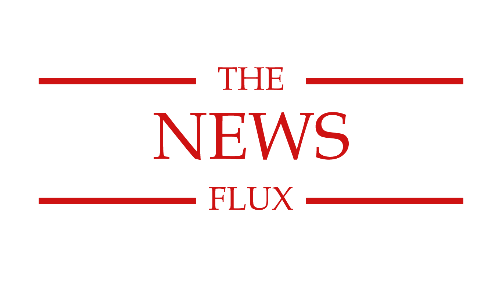
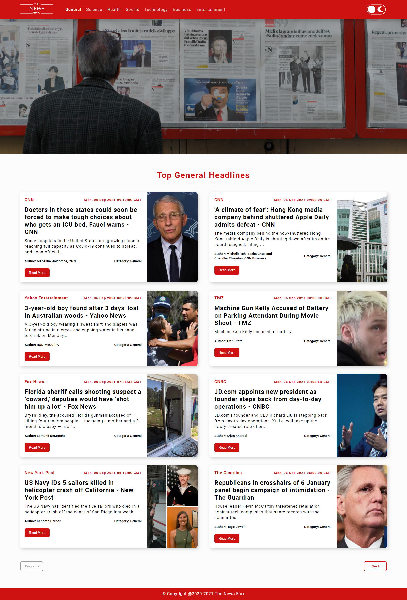
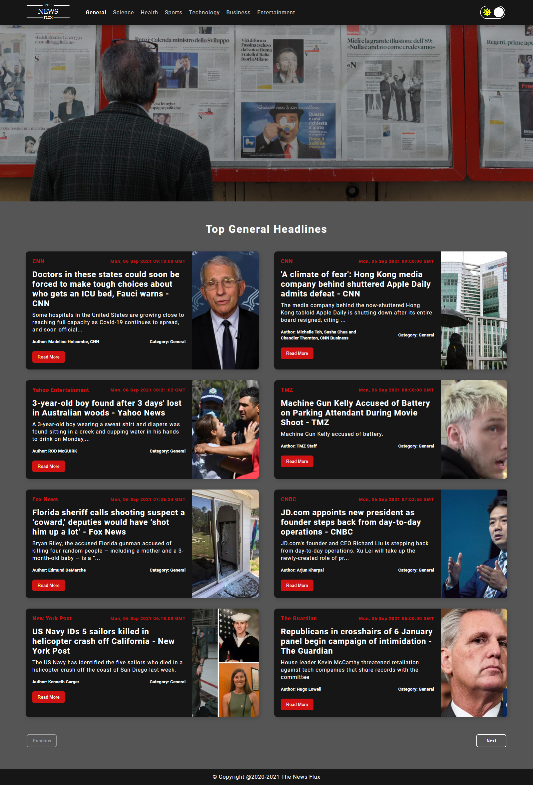
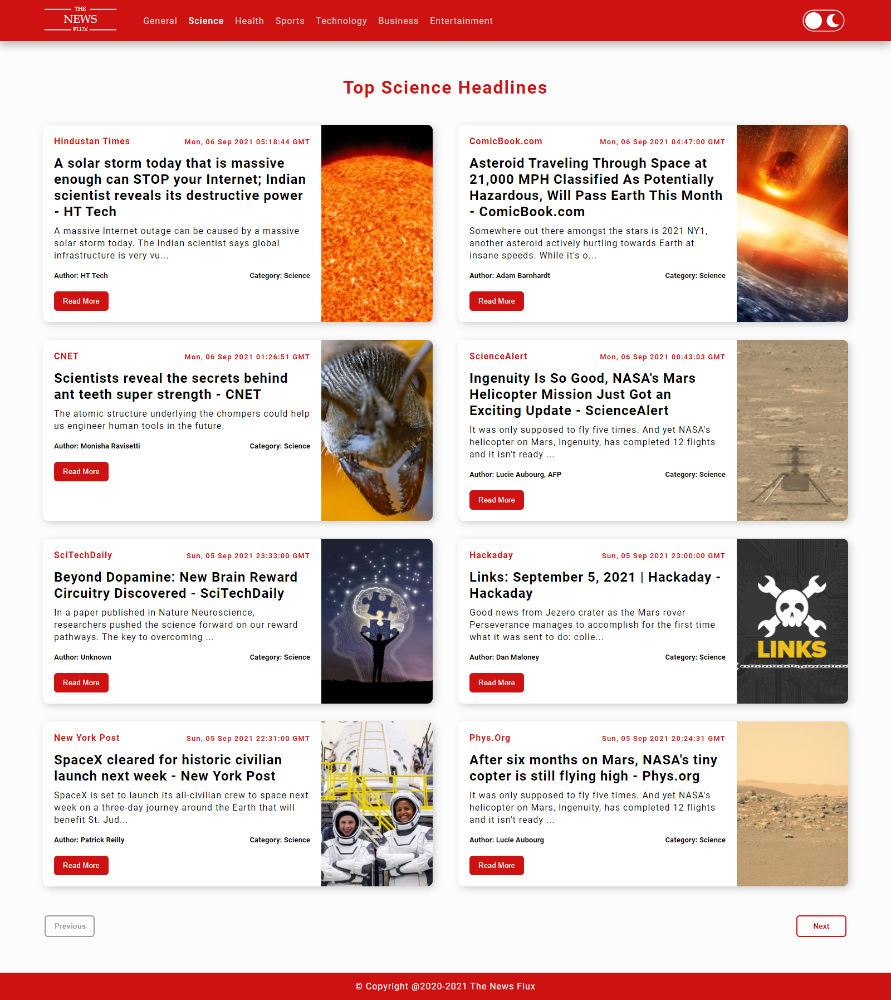
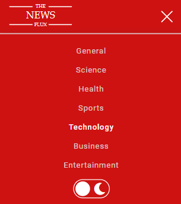
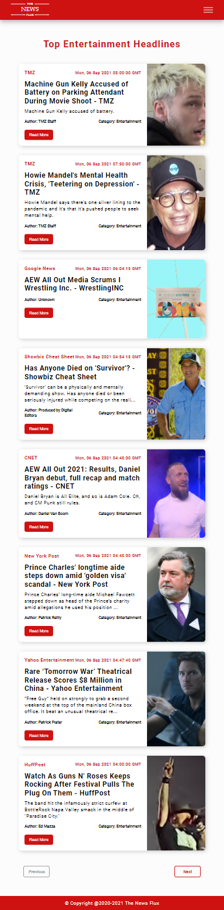
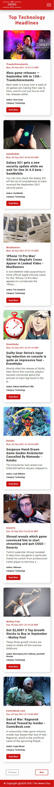

<!-- PROJECT LOGO -->
<br />
<p align="center">
  <a href="https://github.com/sheharyarIshfaq/The-News-Flux">
    
  </a>

  <h3 align="center">The News Flux</h3>

  <p align="center">
    A News Web App build with React js and news API. It fetches top headlines category wise and display them on the frontend
    <br />
  </p>
</p>

<!-- TABLE OF CONTENTS -->
<details open="open">
  <summary>Table of Contents</summary>
  <ol>
    <li>
      <a href="#about-the-project">About The Project</a>
      <ul>
        <li><a href="#built-with">Built With</a></li>
      </ul>
    </li>
    <li>
      <a href="#getting-started">Getting Started</a>
      <ul>
        <li><a href="#installation">Installation</a></li>
      </ul>
    </li>
    <li><a href="#overview">Overview</a></li>
    <li><a href="#contact">Contact</a></li>
  </ol>
</details>

<!-- ABOUT THE PROJECT -->

## About The Project



The News Flux is a Web Application built using React js and an APi from news api. It fetches the top headlines of different category and display them as a induvidual news item with a News source, Date of the news, Title, Description, Image realted to that News, and a read more button which direct the user to a different website to read more about that particular news. It has different categories in the Navbar, clicking on them shows user news related to that category. It also has a button to change the mode to Dark and Light Mode.

I have built this website by using different features of React js including React Hooks, React Context, React Router. React Hooks such as useState, useEffect. Create Context was used to make a context of dark mode and it has used in the whole component to manage the dark mode state. React Router was used to create routes for different news categories.

### Built With

This projects was built using React js, react router, custom css.

- [React](https://reactjs.org/)
- [React Router](https://reactrouter.com/)

<!-- GETTING STARTED -->

## Getting Started

This is an example of how you may give instructions on setting up your project locally.
To get a local copy up and running follow these simple example steps.

### Installation

1. Clone the repo
   ```sh
   git clone https://github.com/sheharyarIshfaq/The-News-Flux.gitt
   ```
1. Install NPM packages
   ```sh
   npm install
   ```
1. Run the project on local host
   ```sh
   npm start
   ```

## Overview

Images of the project

### Main Page


---

### Main Page (Dark Mode)



---

### Category Preview



---

### Responsive Navbar



---

### Ipad Preview



---

### Mobile Preview



---

<!-- CONTACT -->

## Contact

Sheharyar Ishfaq - [Facebook](https://web.facebook.com/sheharyarishfaq1) - [Linkedin](https://www.linkedin.com/in/sheharyar-ishfaq/)

Project Link: [The-News-Flux](https://github.com/sheharyarIshfaq/The-News-Flux)
